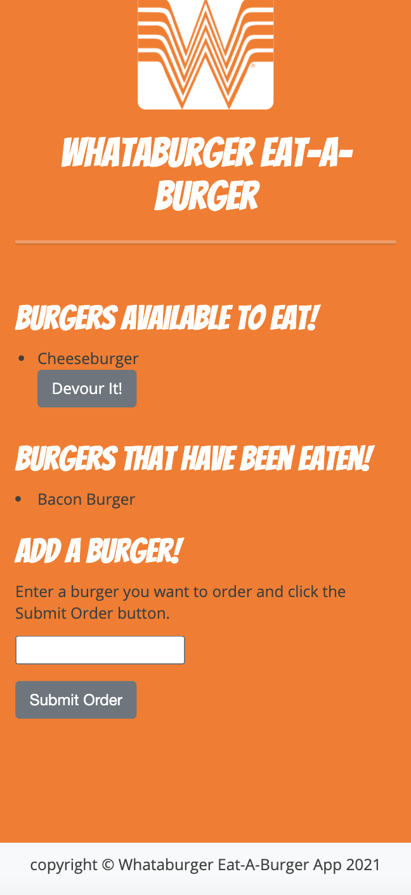

# Whataburger Eat-A-Burger
Eat-Da-Burger! is a restaurant app that lets users input the names of burgers they'd like to eat, and then devour them!

# Goals of the project 
The goal of this projects was to implement MVC design, and demonstrate that I can successfully develop and deploy that app.  

# Accessing the app

[Whataburger App](https://arcane-crag-01125.herokuapp.com)

# Functionality
- Create Burgers:  This allows you enter a string, and add it with the click of a button.  It adds this a mysql database. 
- Devour:  Clicking the devour button adds it to a list of burgers eaten, this flips a devoured flag in the db from false to true.  

#  What to expect 

# Technologies used
- Node.js
- Express.js
- MySQL
- Handlebars
- ORM
